# Mahida's Film/Book Survey!

This extensive code heavy project is a Python based project that is deployed within a terminal. The survey is designed to be taken by users who are either film or book enthusiasts. The extensive nature of the code in this project allows users to choose between either a film or a book survey and depending on their choices they will recieve a tailor-made survey that respects their option. The key in this project was to create a fluid working survey using Python that stores data and can give it back to the user if they so wish by viewing the statistics in the sheet that stores the data entries of the survey. This project could have been 300 lines, 400 lines maybe 500 lines of code... However, the goal was to create a level of complexity and make sure users have many options to choose from and a reasonable amount of questions to answer. 

This page contains a single webpage called :
- run.py / **This file contains the code that is used in this project.**
- This is the link to the [Film/Book Survey](https://film-book-survey-35fbcf323ce8.herokuapp.com/)

## Table of Contents

Click here for the Table of Contents

- [Wireframes](#wireframes)
- [Features](#features)
- [User Stories](#user-stories)
- [UX](#ux)
- [Tools & Technologies](#tools--technologies)
- [Testing](#testing)
- [Deployment](#deployment)
- [Credits](#credits)
- [Acknowledgements](#acknowledgements)

## Wireframes
- This is the initial mockup flowchart that was created in preperation to this project. As you can see within the project the detail has been increased from this with more options present.
- One of the details that is present that is not in this flowchart that has made it into the final edition of the program is raising exceptions and errors everytime the user inputs a non-valid submission for a question.  

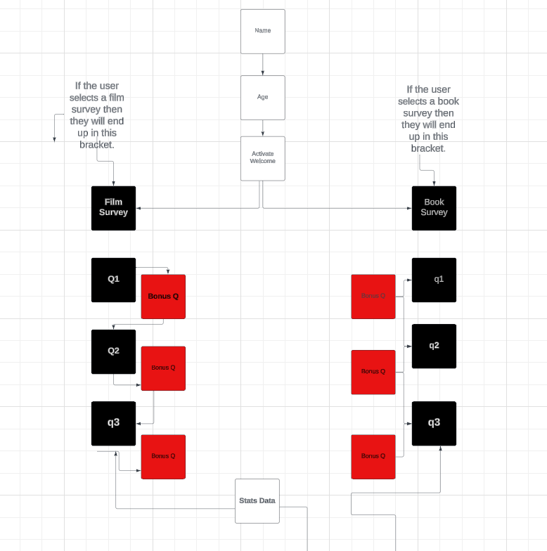

## Features
- The features within this project are not as vividly clear as other projects for example those that use CSS or HTML to style and really take in the users eye. However, the features that are present are interactive as a lanuage like Python should hope to process.

- The program itself is terminal based meaning it's responsive and fast.
- The program additionally, stores the results of user's questions in the survey through Google Sheets that is activated through an API.
- The survey itself is designed to be taken by lovers of film or books and it is inclusive to all ages where humans can process information and come up with valid answers to improve the reliability of the entries in the survey. 
- The age chosen was 7-110.

### Existing Features

| Feature | Description | Screenshot |
| :---: | :---: | :---: |
| **Starting Screen** | The starting screen of the program is designed to be as typical as a program activation can be with the words "Program Activated | 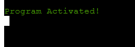 |
| **Name and Age Collection** | The collection of the name and age of the users | 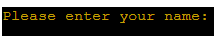 |  |
| **Name and Age Errors** | The program activates an error prompt when the users entry is invalid and explains why. | 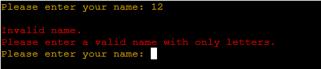 | 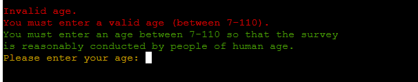 |
| **Survey Selection** | The program allows the user to select the survey they would like to take part in | 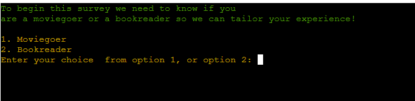 |
| **Return Name** | The name that the user enters within the project is returned to them along with their option so that they understand what survey they are taking it's good UX. | 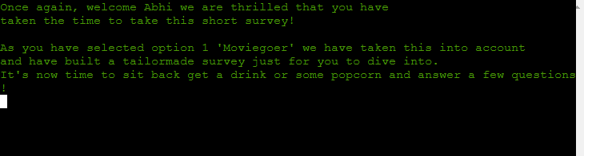 |
| **Question 1** | The first question in the survey gives the user a choice of 4 options that are all given a value between (1-4) which will reflect on the google sheet. |  |
| **Question 2** | The second question in the film survey showcases that the questions differ in their entries. This question asks for a number between 1-10 | 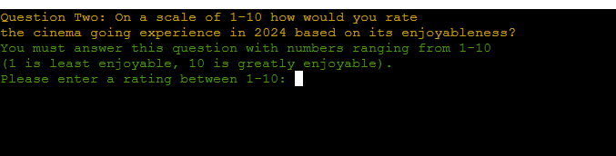 |
| **Bonus Question** | The survey asks bonus questions to the user that are different in color to the normal questions that the user faces. These questions themselves are stored in a different sheet alltogether.  | 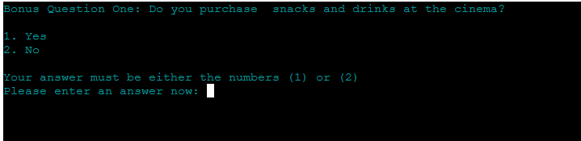 |
| **Question 5** | This table has shifted from Q2 straight to Q5 because the features in Q3 and Q4 are similar. The difference in Q5 is that the selection of the number that you pick directly gives you a question based on your choice right after this. | 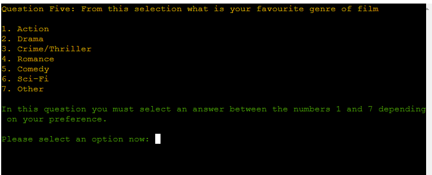 |
| **Question 5 Follow Up Bonus** | The follow up question to Question 5 is giving you a personalised question based on your choice in Q5. If the user picks option 7 in Q5 then they will recieve this in 'Bonus Question Three' | 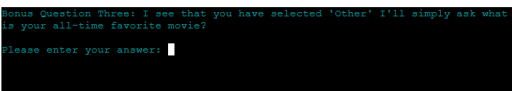 |
| **Final Menu** | This final menu is brought up when the user completes the questions in the survey. The menu is personalised showing the users name and what survey they have taken. The book survey additionally shows that they have taken the book survey. | 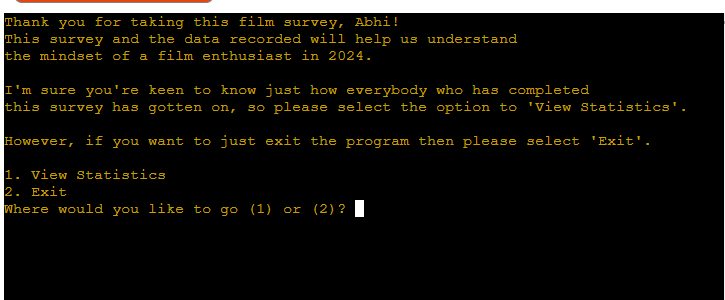 | 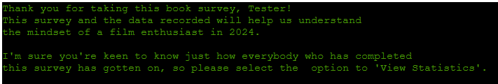 |
| **Final Options** | The final menu contains two different options. 1. View Statistics, 2. Exit. These options allow the user to either check the results of the survey by all users that have completed it. The second option closes the survey completely. | 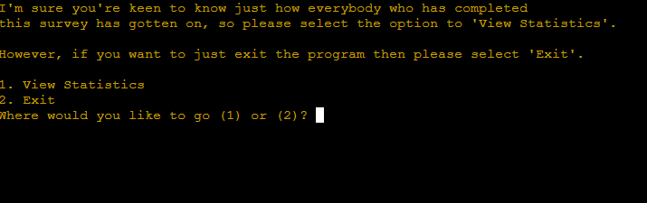 |
| **Exit Message** | There is an exit message that shows once the user selects the exit option. | 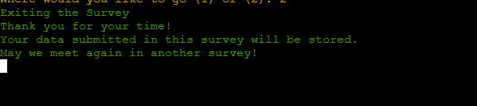 |
| **Stats** | The statistics function when activated by the user with their choice showcases the survey results from every single user that has taken the survey this displays both the film survey and the book survey results that has been processed and delivered to the program with google sheets. | 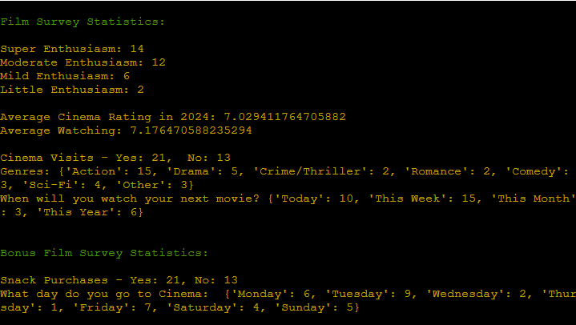 | 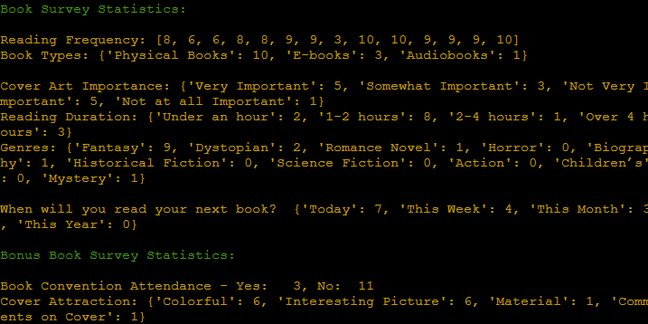 |

### Future Features

## User Stories
1. 
2. 
3. 
4. 
5. 
6. 

## UX

### Color Scheme 

### Typography 

## Tools & Technologies 

## Testing
 
 Please refer to the [TESTING.md](TESTING.md) file to see the testing of the website.

 ## Deployment

### Local Deployment 

### Cloning 

## Credits

##  Acknowledgements
