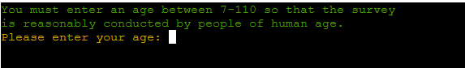
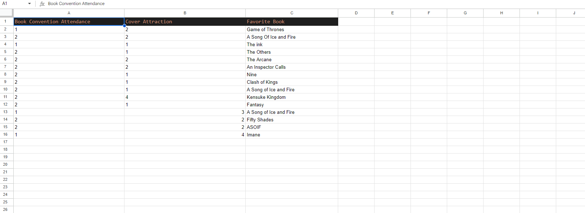

# Mahida's Film/Book Survey!

This extensive code heavy project is a Python based project that is deployed within a terminal. The survey is designed to be taken by users who are either film or book enthusiasts. The extensive nature of the code in this project allows users to choose between either a film or a book survey and depending on their choices they will recieve a tailor-made survey that respects their option. The key in this project was to create a fluid working survey using Python that stores data and can give it back to the user if they so wish by viewing the statistics in the sheet that stores the data entries of the survey. This project could have been 300 lines, 400 lines maybe 500 lines of code... However, the goal was to create a level of complexity and make sure users have many options to choose from and a reasonable amount of questions to answer. 

This page contains a single webpage called :
- run.py / **This file contains the code that is used in this project.**
- This is the link to the [Film/Book Survey](https://film-book-survey-35fbcf323ce8.herokuapp.com/)

## Table of Contents

Click here for the Table of Contents

- [Wireframes](#wireframes)
- [Features](#features)
- [User Stories](#user-stories)
- [UX](#ux)
- [Tools & Technologies](#tools--technologies)
- [Testing](#testing)
- [Deployment](#deployment)
- [Credits](#credits)
- [Acknowledgements](#acknowledgements)

## Wireframes
- This is the initial mockup flowchart that was created in preperation to this project. As you can see within the project the detail has been increased from this with more options present.
- One of the details that is present that is not in this flowchart that has made it into the final edition of the program is raising exceptions and errors everytime the user inputs a non-valid submission for a question.  

## Features
- The features within this project are not as vividly clear as other projects for example those that use CSS or HTML to style and really take in the users eye. However, the features that are present are interactive as a lanuage like Python should hope to process.

- The program itself is terminal based meaning it's responsive and fast.
- The program additionally, stores the results of user's questions in the survey through Google Sheets that is activated through an API.
- The survey itself is designed to be taken by lovers of film or books and it is inclusive to all ages where humans can process information and come up with valid answers to improve the reliability of the entries in the survey. 
- The age chosen was 7-110.

### Existing Features

| Feature | Screenshot | Description |
| :---: | :---: | :---: |
| **Starting Screen** |  | The starting screen of the program is designed to be as typical as a program activation can be with the words "Program Activated" |
| **Name and Age Collection** |   | The collection of the name and age of the users |
| **Name and Age Errors** |   | The program activates an error prompt when the user's entry is invalid and explains why. |
| **Survey Selection** |  | The program allows the user to select the survey they would like to take part in |
| **Return Name** |  | The name that the user enters within the project is returned to them along with their option so that they understand what survey they are taking. It's good UX. |
| **Question 1** |  | The first question in the survey gives the user a choice of 4 options that are all given a value between (1-4) which will reflect on the Google sheet. |
| **Question 2** |  | The second question in the film survey showcases that the questions differ in their entries. This question asks for a number between 1-10. |
| **Bonus Question** |  | The survey asks bonus questions to the user that are different in color to the normal questions that the user faces. These questions themselves are stored in a different sheet altogether. |
| **Question 5** |  | This table has shifted from Q2 straight to Q5 because the features in Q3 and Q4 are similar. The difference in Q5 is that the selection of the number that you pick directly gives you a question based on your choice right after this. |
| **Question 5 Follow Up Bonus** |  | The follow-up question to Question 5 gives you a personalized question based on your choice in Q5. If the user picks option 7 in Q5 then they will receive this in 'Bonus Question Three'. |
| **Final Menu** |   | This final menu is brought up when the user completes the questions in the survey. The menu is personalized showing the user's name and what survey they have taken. The book survey additionally shows that they have taken the book survey. |
| **Final Options** |  | The final menu contains two different options: 1. View Statistics, 2. Exit. These options allow the user to either check the results of the survey by all users that have completed it. The second option closes the survey completely. |
| **Exit Message** |  | There is an exit message that shows once the user selects the exit option. |
| **Stats** |   | The statistics function when activated by the user with their choice showcases the survey results from every single user that has taken the survey. This displays both the film survey and the book survey results that have been processed and delivered to the program with Google Sheets. |

- It is important to understand that these are the main features in the project. The book survey operates exactly the same so I've refrained from adding more descriptions in this table to avoid repititon.

### Future Features
- When I return to this project I would like to add more features that personalize the users experience even more with additional prompts and questions designed to take into account the users previous answers so the survey can feel complex and progressive for the users taking it.
- Additonally, I would love to create a detailed homescreen that provides a spoiler in some ways to what both sides of the survey will entail.

## User Stories
1. As a new user I want to be able to take a fast and easy survey.
2. As a new user, I want to be able to have a preference in either a book or film survey.
3. As a new user, I want to be able to see that the options I choose are reflected back to me in the survey.
4. As a new user, I want the program to understand when I have made an invalid answer.
5. As a new user, once I complete the survey I want to have a clear method of exiting and knowing that the survey is done.
6. As a new user, once I complete the survey I want to have a look at the results of the survey that has been gathered by everybody who has taken it.

## UX
- The project takes use of a command line terminal so there isn't much that is designed to draw the user in with colors, images and videos etc. There isn't a whole lot of options at the disposal of this project. However, as showcased in the features above there are still many different aspects of this project that is designed to make sure the user has a good experience. 

- One of these were the collection of the name and age of the user, this ensures that the user feels involved and valued with their names being returned back to them by the program. It shows initiative and care. 
- Another aspect that is critical to the experience of the user is the relay of data within the statistics so they understand that the survey is not for nothing. There is actual evidence that data is being stored, updated and used. 

- The data model in this project was simply Google Sheets which is a very easy and helpful tool for storing data and retrieving data if anybody reading this README file would like to replicate the project. 

[Spreadsheet link](https://docs.google.com/spreadsheets/d/1CItEB8EXjVia5hxisD0COsFiaz57bzeuxEqTMk5rooI/edit?usp=sharing)

### Color Scheme 
- The color scheme that is used in this project differs as the color is used only in text alone.
- The colors used are imported from colorama through the terminal. This allowed me to use colors that are provided by this program and they are as stated:
- `Yellow` this color was used mainly for the answers and the inputs.
- `Cyan`  this color was used mainly for the bonus questions to differentiate between them and the normal questions.
- `Green`  this color was used mainly for the text that isn't questions. This is for the text that tells the user what to do or gives information to the user.
- `Red`  this color was used to indicate to the user that something is wrong via an invalid answer/input and what they can do to solve it.

## Tools & Technologies 
- This is the tools and technologies used in this project. 
- [Python](https://en.wikipedia.org/wiki/Python_(programming_language)) this language was used as the forefront of the project with all the code in the run.py file being Python.
- [HTML](https://en.wikipedia.org/wiki/HTML) this was used simply in the views folder to create a website terminal.
- [Git](https://git-scm.com/) used to control the site via "git add, git commit -m, git push" and etc.
- [GitHub](https://github.com/) was used to store my code and acess my project repository. 
- [VScode](https://code.visualstudio.com/) used as an IDE through GitPod.
- [Gitpod](https://www.gitpod.io/) used as the IDE to work and code the site.
- [Google Sheets](https://fonts.google.com/) was used to store survey data from the program and return survey data back in the form of stats.
- [Heroku](https://en.wikipedia.org/wiki/Heroku) was used to deploy the project.

## Testing
 
 Please refer to the [TESTING.md](TESTING.md) file to see the testing of the website.

 ## Deployment
- This site was deployed via Heroku and not GitHub Pages. Therefore, steps to deploy on GitHub pages will not be present in this README.md file. However, steps to local deployment, forking, cloning and the main deployment to Heroku will be detailed in full so you can replicate this project or have a better understanding of deployment. 

### Local Deployment 
- Through the process of forking, you can copy the entire original repository of this project on to your GitHub account without affecting the code and changing the original repository of the project. To fork this please follow these exact steps. 

1. Go to the [GitHub repository](https://github.com/mahidaCodeTrained/project3data) for this project.
2. At the top of the screen where you can find the project name scroll over to the right with your cursor and find the "Fork" symbol.
3. Click this option.
4. Once you have clicked on Fork then you should have a copy of the original repository for your disposal. 

### Cloning 
This repository can be cloned by following these steps.

1. Go to the [GitHub repository](https://github.com/mahidaCodeTrained/project3data) for the project.
2. There should be a code button telling you if you would like to clone this project. It will be next to the add files button.
3. It should tell you if you would like to clone via. HTTPS, SSH or a GitHub CLI, once you have decided what you want to use to clone the repository then click the copy button to copy the url of the project.
4. Open Git Bash or a Terminal
5. Once inside, change the working directory to the one where you want the cloned directory that you have copied from the GitHub repository.
6. In the IDE terminal, you can now clone this repository by inputting this command:
   - `git clone https://github.com/mahidaCodeTrained/project3data`

### Heroku Deployment
- In order to deploy this project to Heroku you will need to make sure that a step of certanties are accomplished.

1. You will need to have your Python file primed and ready for deployment to Heroku by updating the requirements.txt file.
> In order to accomplish this you must run the command `pip3 freeze > requirements.txt` into the terminal of your workspace.
> As soon as this is completed you will see that your requirements.txt file will be updated with the neccesary requirements needed to deploy to Heroku but it isn't done just yet...

2. As soon as you have completed this step then you need to save your changes and push to GitHub.
> You will need to `git add` and `git commit -m` the file then proceed to use `git push` to push the changes.

3. You now must visit the [Heroku Dashboard](https://dashboard.heroku.com/)
> Once inside the Heroku Dashboard fill out the steps required and create a login.
> Once this is done and you have access to the dashboard you will want to `create a new app` and log your region aswell.

4. Once you have created a new app then you want to go to the Settings tab on Heroku for your project and head over to Config Vars
> Within the Config Vars subsection in the settings you will want to create two different keys.
> There will be two different entries available to you. "KEYS" and "VALUES".
> In "KEYS" add the word "CREDS" in uppercase.
> In the values entry copy and paste the creds.json file in your workspace into the value entry. Once done click save.
> You will now want to create an additional key called "PORT" all uppercase. You will want to put the value as "8000" once done save.

5. Once completed scroll down and find "buildpacks".
> In buildpacks select "add buildpacks" and choose Python.
> Once you have added Python add another buildpack called node.js

6. You will now want to connect to GitHub through selecting the deploy tab on Heroku.
> Find the deploy tab and click connect to GitHub
> Once you have clicked connect to GitHub a search bar will open showcasing the repository that you want to select.
> Click on the correct repository for the project as this will link Heroku to your GitHub repository taking the details from it. 

7. Deploy
> Once this is all done scroll down and you will see there are two options to either "Automatic Deploy" or "Manual Deploy"
> If you select "Automatic" deployment then everytime you commit and push changes to GitHub from your codespace, then the Heroku live app will also automatically update. 
> If you pick "Manual" then you will have to update it as the name suggests manually.

8. Enjoying your new deployed project.
> You will now see that there is a tab that takes you to your deployed project on Heroku.
> Enjoy.

## Credits

##  Acknowledgements
