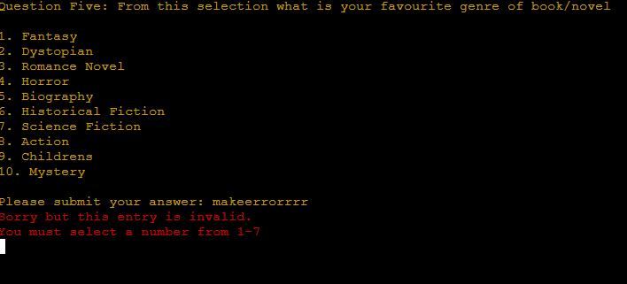

Return to the [README.md](README.md) file.

## Table of Contents

Click here for Table of Contents

- [Validation](#validation)
  - [Python](#python)
 
- [Lighthouse](#lighthouse)

- [User Story Testing](#user-story-testing)

- [Input Testing](#input-testing)

- [Manual Testing](#manual-testing)

- [Bugs](#bugs)

## Validation 
- This will show that the Python code is completely validated and correctly placed.

### Python

| Page | URL | Screenshot | Notes |
| :---: | :---: | :---: | :---: |
| run.py | [CI Python Linter](https://pep8ci.herokuapp.com/#) |  | Passed all checks |

## Lighthouse
Although Lighthouse isn't really a huge testing for this project, I've decided to include it to make sure I've taken every reasonable step in testing.

| Page   | Mobile                                                                                  | Desktop                                                                                   | Notes                                                                                                                                                                         |
| :----: | :-------------------------------------------------------------------------------------: | :---------------------------------------------------------------------------------------: | :---------------------------------------------------------------------------------------------------------------------------------------------------------------------------- |
| run.py |  |  | The site that the program is running on is running very well if not perfectly. The only hiccups that can be spotted with the 95 "Accessibility" score are completely out of my control due to the run program button and contrast issues. |

## User Story Testing 

| User Story | Screenshot |
| :---: | :---: |
| As a new user I want to be able to take a fast and easy survey. |  |
| As a new user, I want to be able to have a preference in either a book or film survey. |  |
| As a new user, I want to be able to see that the options I choose are reflected back to me in the survey. |  |
| As a new user, I want the program to understand when I have made an invalid answer.|  |
| As a new user, once I complete the survey I want to have a clear method of exiting and knowing that the survey is done.|   |
| As a new user, once I complete the survey I want to have a look at the results of the survey that has been gathered by everybody who has taken it.|  |

## Input Testing

- For the film and book sections of the survey all of the inputs work as expected and they will provide error messages incase there is a wrong submission that is placed in the input. I will go through each question and showcase this in a table with both book and film inputs being tested.

| Question | Film | Book | Notes |
| :---: | :---: | :---: | :---: |
| Question 1 |  |  | If there is an incorrect input in the input field an error message pops up defending the program. |
| Bonus Question 1 |  |  | If there is an incorrect input it shows the error message defending the program. |
| Question 2 |  |  | If there is a wrong input then the error message pops up. |
| Question 3 |  |  | If there is a wrong input then the error message pops up. |
| Bonus Question 2 |  |  | If there is a wrong input then the error message pops up. |
| Question 4 |  |  | If there is a wrong input then the error message pops up. |
| Question 5 |  |  | If there is a wrong input then the error message pops up. |
| Bonus Question 3 |  |  | There aren't any errors in this because this data although collected is not displayed and is a free entry for the user to tell what their favourite film is. |
| Question 6 |  |  | If there is a wrong input then the error message pops up. |

- The reason that bonus data 3 is not shown back to the user is simply for the user experience. the amount of entries that are placed will flood the statistics making it hard to read and adding too much visual clutter where it really is not needed. The crucial data the data that is analytical is processed and is delievered to the user that's the data that matter, that's the data that counts. 

- There are additional errors catching statements.

