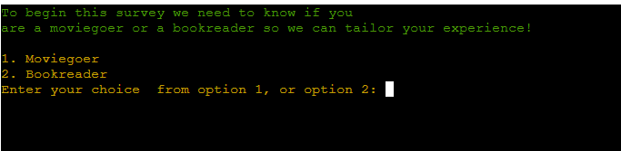
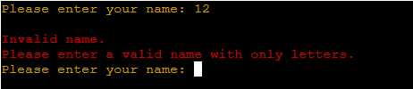

Return to the [README.md](README.md) file.

## Table of Contents

Click here for Table of Contents

- [Validation](#validation)
  - [Python](#python)
 
- [Lighthouse](#lighthouse)

- [User Story Testing](#user-story-testing)

- [Input Testing](#input-testing)

- [Manual Testing](#manual-testing)

- [User Validation Testing](#user-validation-testing)

- [Bugs](#bugs)

## Validation 
- This will show that the Python code is completely validated and correctly placed.

### Python

| Page | URL | Screenshot | Notes |
| :---: | :---: | :---: | :---: |
| run.py | [CI Python Linter](https://pep8ci.herokuapp.com/#) |  | Passed all checks |

## Lighthouse
Although Lighthouse isn't really a huge testing for this project, I've decided to include it to make sure I've taken every reasonable step in testing.

| Page   | Mobile                                                                                  | Desktop                                                                                   | Notes                                                                                                                                                                         |
| :----: | :-------------------------------------------------------------------------------------: | :---------------------------------------------------------------------------------------: | :---------------------------------------------------------------------------------------------------------------------------------------------------------------------------- |
| run.py |  |  | The site that the program is running on is running very well if not perfectly. The only hiccups that can be spotted with the 95 "Accessibility" score are completely out of my control due to the run program button and contrast issues. |

## User Story Testing 

| User Story | Screenshot |
| :---: | :---: |
| As a new user I want to be able to take a fast and easy survey. |  |
| As a new user, I want to be able to have a preference in either a book or film survey. |  |
| As a new user, I want to be able to see that the options I choose are reflected back to me in the survey. |  |
| As a new user, I want the program to understand when I have made an invalid answer.|  |
| As a new user, once I complete the survey I want to have a clear method of exiting and knowing that the survey is done.|   |
| As a new user, once I complete the survey I want to have a look at the results of the survey that has been gathered by everybody who has taken it.|  |

## Input Testing

- For the film and book sections of the survey all of the inputs work as expected and they will provide error messages incase there is a wrong submission that is placed in the input. I will go through each question and showcase this in a table with both book and film inputs being tested.

| Question | Film | Book | Notes |
| :---: | :---: | :---: | :---: |
| Question 1 |  |  | If there is an incorrect input in the input field an error message pops up defending the program. |
| Bonus Question 1 |  |  | If there is an incorrect input it shows the error message defending the program. |
| Question 2 |  |  | If there is a wrong input then the error message pops up. |
| Question 3 |  |  | If there is a wrong input then the error message pops up. |
| Bonus Question 2 |  |  | If there is a wrong input then the error message pops up. |
| Question 4 |  |  | If there is a wrong input then the error message pops up. |
| Question 5 |  |  | If there is a wrong input then the error message pops up. |
| Bonus Question 3 |  |  | There aren't any errors in this because this data although collected is not displayed and is a free entry for the user to tell what their favourite film is. |
| Question 6 |  |  | If there is a wrong input then the error message pops up. |

- The reason that bonus data 3 is not shown back to the user is simply for the user experience. the amount of entries that are placed will flood the statistics making it hard to read and adding too much visual clutter where it really is not needed. The crucial data the data that is analytical is processed and is delievered to the user that's the data that matter, that's the data that counts. 

- There are additional errors catching statements.

## Manual Testing

| Test | Result |
|--|--|
|Question 1: When the user places the appropriate input it passes through|Pass|
|Question 2: When the user places the appropriate input it passes through|Pass|
|Question 3: When the user places the appropriate input it passes through|Pass|
|Question 4: When the user places the appropriate input it passes through|Pass|
|Question 5: When the user places the appropriate input it passes through|Pass|
|Question 6: When the user places the appropriate input it passes through|Pass|
|Bonus Question 1: When the user places the appropriate input it passes through|Pass|
|Bonus Question 2: When the user places the appropriate input it passes through|Pass|
|Bonus Question 3: When the user places the appropriate input it passes through|Pass|
|The age passes through when the correct input that is stated is sent by the user|Pass|
|The name passes through when the correct input is entered by the user without numbers|Pass|
|When the user clicks to view statistics it passes through|Pass|
|When the user clicks to exit the program exits the user.|Pass|
|When the user chooses between the two survey options it places them on the correct one.|Pass|

- The Question 1-6 and Bonus Question 1-3 are both checked and validated by me. 
- These questions are for both the film and book survey. 
- To make sure that repitition is at a low I have decided to just add it only once instead of twice for both the film survey and book survey. However, the statement is meant to be for both. 

## User Validation Testing

| Question | Film | Book | Notes |
| :---: | :---: | :---: | :---: |
| Question 1 |  |  | This showcases that the inputs are validated and the correct submission is bringing about a prompt indiciating that the question is completed and data is being stored. |
| Bonus Question 1 |  |  | This showcases that the inputs are validated and the correct submission is bringing about a prompt indiciating that the question is completed and data is being stored. |
| Question 2 |  |  | This showcases that the inputs are validated and the correct submission is bringing about a prompt indiciating that the question is completed and data is being stored. |
| Question 3 |  |  | This showcases that the inputs are validated and the correct submission is bringing about a prompt indiciating that the question is completed and data is being stored. |
| Bonus Question 2 |  |  | This showcases that the inputs are validated and the correct submission is bringing about a prompt indiciating that the question is completed and data is being stored. |
| Question 4 |  |  | This showcases that the inputs are validated and the correct submission is bringing about a prompt indiciating that the question is completed and data is being stored. |
| Question 5 |  |  | This showcases that the inputs are validated and the correct submission is bringing about a prompt indiciating that the question is completed and data is being stored. |
| Bonus Question 3 |  |  | These are always successful due to any input being allowed in this. It's mainly for creative purposes and allows the user to engage and think. |
| Question 6 |  |  | This showcases that the inputs are validated and the correct submission is bringing about a prompt indiciating that the question is completed and data is being stored. |

## Bugs 

- This project has encountered a few bugs from it's inception to now. The main bugs that the project had have been eradicated. I will detail them now.
1. There was a bug with three different data collection questions with the variables being assigned an int(append) this caused an issue within the terminal when users tried to submit their answers.
> Of course the answers that were numbers between lets say 1-4 for a question that demanded an answer between 1-4 passed through the question without an issue. However, the problem arose when a user inputted a string inside the input field it completely shut down the entire project. I caught three instances of this bug and I have exterminated it. 

2. There was another bug that didn't allow data to be retrieved from my google sheet due to the way my data recovery process in view_statistics() was functioned. It ended up making all counts go into only one bracket for the data. I have annihilated this bug. 

- I will be on the lookout for anymore bugs that can destroy the experience or the functionality of the project but as of now those are the only bugs encountered. 